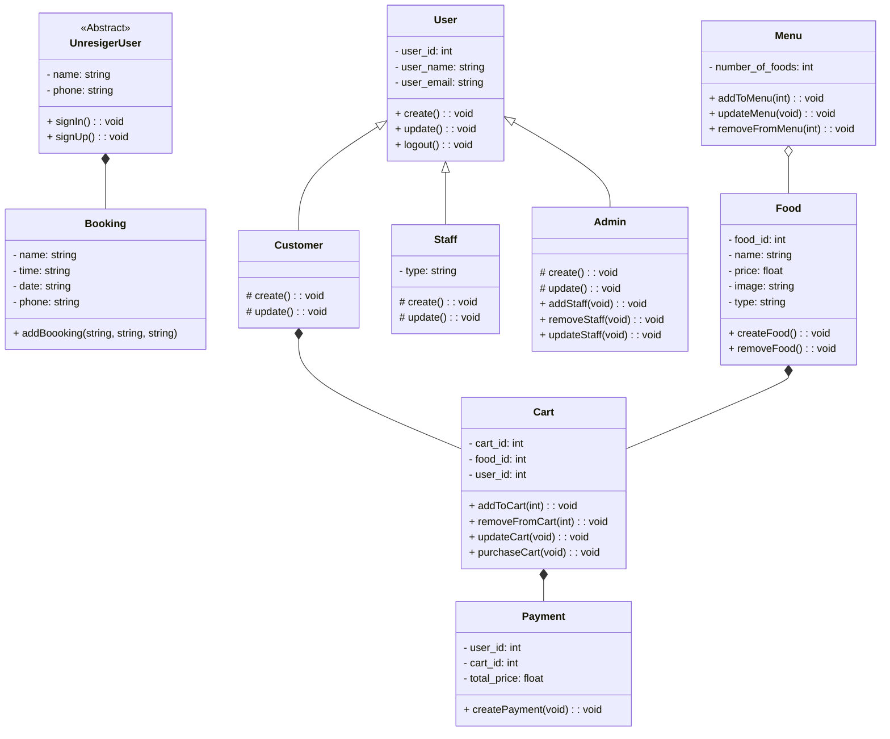

# Welcome to Baos Restaurant project
## Advance Software Engineering Project

This project was bootstrapped with [Create React App](https://github.com/facebook/create-react-app).

**Contributors:**
- Vũ Bình Gia Uy (2059048)
- La Triệu Huy (2059016)
- Ngô Trung Hải (2059012)
- Châu Nhật Minh (2059028)
- Nguyễn Trương Thanh Tâm (2059053)

## How to run the project
Before running the project, you need to type **`npm install`** in terminal first to install folder node module from package.json.

Secondly, type **`npm i @chakra-ui/react @emotion/react @emotion/styled framer-motion`** in terminal to install chakra ui (if it is not successful, add **`--force`** after the sentence with space between)

When you have done installed, you can finally type: **`npm run start`**

It will run the app in the development mode.\
Open [http://localhost:3000](http://localhost:3000) to view it in your browser.

## Project Class Diagram
